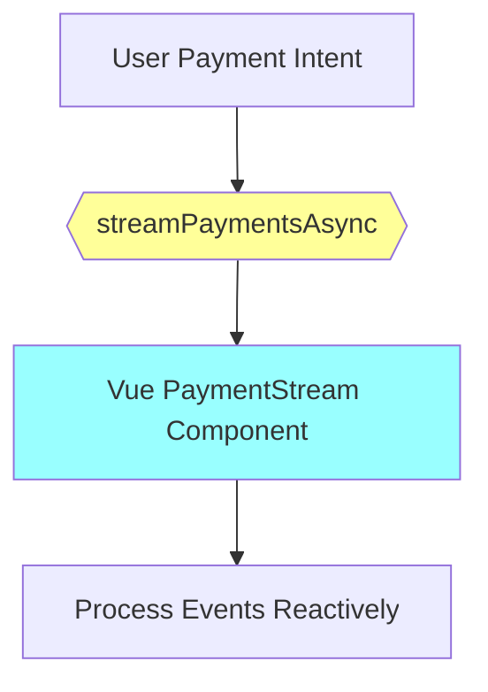

# 05 – Vibe Coding Principles
**File Path:** rules/02-semantics/05-vibe-coding.md  
**Domain:** TODO: <Project Domain, e.g., "E-commerce payments">  
**Last Updated:** 2026-01-22  
**Status:** Active  

<!-- FILE_TITLE: Vibe-Coding Core Principles -->  
<!-- FILE_PATH: rules/02-semantics/05-vibe-coding.md -->

---

## 🎯 Purpose
Defines semantic coding practices that embed execution context, domain intent, and system behavior directly into code structure through naming patterns, annotations, and strict organization. This enables LLM-assisted maintenance, human readability, and cross-stack consistency in reactive systems.

## 📌 Scope
- **Applies to:** All Java/WebFlux reactive streams, Vue/TypeScript components, and Gradle build scripts.
- **Excludes:** Third-party library implementations, auto-generated code, and legacy blocking systems.
- **Dependencies:** See 06-naming-conventions.md (base patterns), 12-annotations.md (tag usage), and 22-gradle-multimodule.md (build sequencing).

---

## 🧠 Semantic Anchors
### 1. Intent-Driven Naming (Verb-Domain-Modality Pattern)
**Why:** Names must reveal execution model (reactive/blocking), data flow, and domain intent in under 3 seconds.

**Backend (Java/WebFlux) Example:**
```java
// Reactive stream with clear async context
@Semantic("EventStream")
public Flux<UserEvent> streamUserActivityAsync(String userId) { 
    // Emphasizes non-blocking continuous emission
    return userRepo.findById(userId).flatMapMany(this::emitEvents);
}
```

**Frontend (Vue/TypeScript) Example:**
```typescript
// Typed prop mirroring backend Flux
interface Props {
    userActivityStream: UserEvent[];  // @Vibe: "Mirrors backend Flux for live updates"
}
const props = defineProps<Props>();
```

**Validation:** Enforce via ESLint (TS) and Checkstyle (Java); fail builds without `*Async`, `*Flux`, or `*Mono` suffixes.

### 2. Annotation Taxonomy
- `@Semantic("Boundary")`: Marks API contracts or architectural roles (e.g., "AggregateRoot", "DataflowBoundary").
- `@Vibe("Context")`: Explains non-obvious decisions (e.g., "Circuit-breaker for payment service to ensure resilience").

**Example:**
```java
@Vibe("Cross-Module Boundary – Isolates payment failures from core logic")
@Semantic("PaymentGatewayAdapter")
public class StripeAdapter { 
    public Mono<PaymentResult> processPaymentAsync(PaymentIntent intent) { ... }
}
```

### 3. Code Section Ordering
Mandatory structure for readability and automated parsing:
1. **Imports** (Grouped: Core > Domain/Project > External/Third-party)
2. **Constants** (`CONSTANT_CASE`, prefixed e.g., `PUBLIC_API_ENDPOINT`)
3. **Domain Models** (DTOs/Entities with `@Semantic` tags)
4. **Reactive Logic** (Mono/Flux chains with modality suffixes)
5. **Component Exports** (Vue typed props and setup)

---

## 🧠 Vibe Coding Rules
### Mandatory Practices
- **3-Second Readability Test**: Method names must convey intent without reading the body (e.g., `validatePaymentIntentAsync()` instead of `processData()`).
- **Modality Suffixes**: Use `*Async`, `*Stream`, `*Flux`, or `*Mono` for execution context in reactive methods.
- **Cross-Stack Mirroring**: Java DTOs must sync with TypeScript interfaces (e.g., `PaymentDto` ↔ `PaymentProps`).

### Anti-Patterns
```java
// ❌ Violation: Blocking method without markers; ambiguous intent
public List<User> getUsers() { ... }

// ✅ Compliance: Reactive with semantic context and suffix
@Semantic("AggregateLoader")
public Flux<User> streamActiveUsersAsync() { ... }
```

**Additional Imperatives:**
- **Reactive Beaconing:** All async operations explicitly signal their model to avoid hidden blocking.
- **Emotional Integrity:** Code should "feel" intuitive, capturing the "vibe" of the system's intent.

---

## ⚙️ Enforcement Mechanics
| Aspect              | Tool/Mechanism                  | Action on Failure             |
|---------------------|---------------------------------|-------------------------------|
| Naming Patterns     | ESLint (TS), Checkstyle (Java)  | Block CI pipeline / PR        |
| Semantic Tags       | Custom Gradle task              | Fail build                    |
| Code Structure      | IDE Formatters, SonarQube       | Auto-reorder on save / Warn   |
| Reactive Suffixes   | Gradle `verifySemantics`        | Auto-flag in reviews          |

**CI/CD Integration Example (Gradle):**
```kotlin
// build.gradle.kts
tasks.register("verifyVibe") {
    dependsOn("compileJava", ":frontend:lint")
    doLast {
        // Scan for @Semantic/@Vibe annotations and naming compliance
        exec { commandLine("node", "scripts/validate-vibe.js") }
    }
}
```

**Local Validation:** Run `./gradlew verifyVibe` to enforce rules before commits.

---

## 🔧 Technical Specifications
### Java/WebFlux Implementation
- **Reactive Methods:** Must return `Mono`/`Flux` with suffixes; tag blocking code for deprecation.
  ```java
  @Vibe("Isolation: Payment processing with rollback on failure")
  @Semantic("Dataflow")
  public Flux<OrderEvent> publishOrderStreamAsync(OrderId id) {
      return orderRepo.findById(id).flatMapMany(this::processEvents);
  }

  @Deprecated(since = "v1.2", forRemoval = true, because = "Violates reactive contract")
  public List<Order> fetchOrdersBlocking() { ... }
  ```

### Vue/TypeScript Implementation
- **Props and Interfaces:** Strictly typed to match backend; no `any` types.
  ```vue
  <script setup lang="ts">
  /**
   * @Semantic("ActivityMonitor")
   * @Vibe("Live updates from SSE stream via backend Flux")
   */
  interface Props {
      paymentStream: Payment[];  // Mirrors Java Payment DTO
  }
  const props = defineProps<Props>();
  </script>
  ```

**Workflow Integration (Mermaid Blueprint):**


---

## 📋 Compliance Checklist
- [ ] All reactive methods use modality suffixes (`*Async`/`*Flux`/`*Mono`) and pass 3-second readability test.
- [ ] `@Semantic` and `@Vibe` annotations on boundaries and complex logic.
- [ ] Cross-stack type definitions synchronized (Java DTOs ↔ TS interfaces).
- [ ] Code sections ordered as specified; no inline JS/CSS in Vue.
- [ ] Gradle task `verifyVibe` passes; no anti-patterns detected.

---

## 🔗 Interlocks
- **Naming:** Aligns with 06-naming-conventions.md for DTO/entity suffixes.
- **Annotations:** Requires 12-annotations.md patterns.
- **Build:** Integrates with 22-gradle-multimodule.md for sequencing.
- **Testing/Diagrams:** Validated by 18-unit-testing.md and 14-mermaid-diagrams.md.

---

## 📜 Revision History
| Version | Date       | Author          | Changes Summary                                      |
|---------|------------|-----------------|------------------------------------------------------|
| 1.0     | 2026-01-22 | LLM-Generated   | Initial active version with enforcement and examples |

---

## Implementation Guide
1. **Clone Template:** `cp VIBE_TEMPLATE.md rules/02-semantics/05-vibe-coding.md`.
2. **Inject Domain Specifics:** Replace placeholders (e.g., `Payment` with `Order` or project entities); adapt examples to domain (e.g., "Secure payment processing").
3. **Validate Locally:** Run `./gradlew verifyVibe` and fix issues.
4. **PR Workflow:** Reference this doc in descriptions; use branch names like `feat/stream-payment-events`.
5. **Version Assets:** Ensure Vue builds to `/static/v1/` with Gradle cache-busting.

**Differentiators:** 
- LLM-parseable tags (`@Semantic`/`@Vibe`) for automated analysis.
- Unified reactive naming and structure across Java/TypeScript stacks.
- Visual intent mapping via Mermaid for better team alignment.
- Focus on "vibe" – intuitive, context-rich code that feels alive and maintainable.
