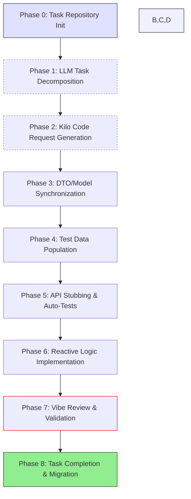

# 13 – Feature Lifecycle – LLM-Driven Mini-Sprint Development

**File Path:** rules/04-workflow/13-feature-lifecycle.md  
**Domain:** TODO: <business-context> (e.g., "Secure e-commerce payment processing with real-time event streaming")  
**Last Updated:** 2026-01-23
**Status:** Active  

---

## 🎯 Purpose  
Establish a streamlined, AI-assisted 8-phase feature development lifecycle that leverages LLM-driven decomposition, semantic annotations, and automated artifact generation. This process ensures semantic consistency, reactive programming patterns, and rapid delivery across Java/Spring WebFlux backends and Vue/TypeScript frontends within 2-5 day mini-sprints, while integrating task repository management for prioritization and tracking.

## 📌 Scope  
- **Applies to:** All atomic feature developments (e.g., new APIs, components, or integrations) executed as mini-sprints  
- **Excludes:** Hotfixes, pure infrastructure updates, and non-code documentation changes  
- **Dependencies:**  
  - `05-vibe-coding.md` (Semantic and vibe annotation standards)  
  - `06-naming-conventions.md` (Consistent naming across stacks)  
  - `14-mermaid-diagrams.md` (Diagram syntax and validation)  
  - `16-review-checklist.md` (PR review gates)  
  - `17-test-pyramid.md` (Testing structure)  
  - `20-test-data-profiles.md` (YAML profile management)  
  - `22-llm-agent-protocols.md` (LLM interaction templates)  
  - `tasks/README.md` (Task repository guidelines)

---

## 🧠 Semantic Anchors

### 1. Enhanced Mini-Sprint Lifecycle Flow


### 2. Task Repository Structure
```
/tasks/
├── domains/
│   └── payment-fraud-detection/
│       ├── incomplete.md  # Priority-ordered backlog (e.g., High/Med/Low)
│       └── completed.md   # Auto-archived on PR merge
└── global/
    └── sprint-backlog.md  # Cross-domain overview
```

**Example `incomplete.md` Entry:**
```markdown
## Payment Fraud Detection Sprint (2026-03-15)
| Priority | Task ID       | Description                                       | Est. Effort |
|----------|---------------|---------------------------------------------------|-------------|
| High     | F-26-01-25-00 | Real-time fraud scoring via WebFlux streams       | 2 days      |
| Med      | F-26-01-26-00 | Vue dashboard for fraud alerts                    | 1 day       |
| Low      | F-26-02-26-01 | Integrate fraud DTOs with existing payment schema | 1 day       |
```

---

## 🔧 Technical Specifications

### Phase 0: Task Repository Initialization
- **Manual/Automated Setup:** Create prioritized tasks in `/tasks/domains/[domain]/incomplete.md`.  
- **CLI Command:**  
  ```bash
  kilo-cli init-task --domain payment-fraud-detection --id F-26-01-25-00 --desc "Real-time fraud scoring" --priority high
  ```
- **Enforcement:** Pre-commit hook scans for valid task format (ID, desc, priority).

### Phase 1: LLM Task Decomposition
- **Input:** Domain schema snapshot (Java models + TS types) + problem statement (e.g., "Implement real-time fraud detection for payments >$5000").  
- **LLM Prompt Template (`llm-input.json`):**  
  ```json
  {
    "domain": "payment-fraud-detection",
    "schema": {
      "java": ["PaymentEventDto.java", "UserProfileDto.java"],
      "typescript": ["PaymentEvent.ts"]
    },
    "requirements": "Detect high-value anonymous transactions with risk scoring; generate Mermaid diagram, DTO updates, and edge-case test profiles",
    "constraints": "Reactive streams only; semantic tags mandatory"
  }
  ```
- **Output Artifacts:**  
  - Mermaid diagram (e.g., `/specs/v1-fraud-flow.mmd`).  
  - DTO skeletons.  
  - Test profile outlines.  
- **Validation:** Mermaid CLI for diagram syntax; custom script for semantic completeness.

### Phase 2: Kilo Code Request Generation
- **Automation:** Gradle task `generateKiloRequest` processes LLM output into structured spec.  
- **Example Output (`kilo-request.json`):**  
  ```json
  {
    "feature": "F-26-01-25-00",
    "diagram": "specs/v1-fraud-flow.mmd",
    "dtos": [
      {
        "backend": "FraudEventDto.java",
        "frontend": "FraudEvent.ts",
        "fields": [
          {"name": "transactionId", "type": "String", "semantic": "TransactionID"},
          {"name": "riskScore", "type": "Integer", "semantic": "FraudScore", "vibe": "Real-time alert threshold >80"}
        ]
      }
    ],
    "testProfiles": ["high-risk-transactions.yml"],
    "apiEndpoints": ["/fraud/stream", "method: GET, response: Flux<FraudAlert>"]
  }
  ```

### Phase 3: DTO/Model Synchronization
- **Generation:** Auto-mirror Java DTOs to TS interfaces using `@Semantic`/`@Vibe` annotations.  
- **Backend Example:**  
  ```java
  import reactor.core.publisher.Flux;
  import org.springframework.vibe.Vibe;

  @Semantic("FraudEvent")
  @Vibe("Reactive fraud detection payload for payment streams")
  public record FraudEventDto(
      @Semantic("TransactionID") String transactionId,
      @Semantic("AmountInCents") long amountCents,
      @Semantic("FraudScore") int riskScore  // 0-100 scale, >80 triggers alert
  ) {}
  ```
- **Frontend Mirror:**  
  ```typescript
  // AUTO-GENERATED: Mirrors FraudEventDto.java
  export interface FraudEvent {
    /** @Semantic("TransactionID") */
    transactionId: string;
    /** @Semantic("AmountInCents") */
    amountCents: number;
    /** @Semantic("FraudScore") */
    riskScore: number;  // Optional for incomplete streams
  }
  ```
- **Enforcement:** Gradle task `verifyDtoSymmetry` (compares field count, types, semantics; requires 100% match).

### Phase 4: Test Data Population
- **Format:** YAML profiles in `/test-profiles/[domain]/`.  
- **Example (`high-risk-transactions.yml`):**  
  ```yaml
  testProfiles:
    highRisk:
      - id: "tx-high-001"
        amountCents: 15000
        riskScore: 95
        expected: { alert: true, reason: "High-value anonymous" }
    edgeCase:
      - id: "tx-invalid-001"
        amountCents: -100  # Invalid amount
        riskScore: 0
        expected: { alert: false, reason: "Invalid data" }
  ```
- **Integration:** Loaded via Spring `@ActiveProfiles` or Vitest globals.

### Phase 5: API Stubbing & Auto-Tests
- **Backend Stub Example:**  
  ```java
  @RestController
  @RequestMapping("/fraud")
  @Vibe("Generated reactive stubs for fraud detection")
  public class FraudController {
      @GetMapping("/stream")
      public Flux<FraudAlertDto> streamFraudEvents() {
          // AUTO-GENERATED STUB: Replace with implementation
          return Flux.error(new UnsupportedOperationException("Implement reactive fraud logic"));
      }
  }
  ```
- **Auto-Generated Backend Test (JUnit + Reactor Test):**  
  ```java
  @Test
  @DisplayName("Stream emits fraud alerts for high-risk events")
  void streamFraudEvents_HighRisk_EmitsAlert() {
      var profile = TestProfiles.load("high-risk-transactions.yml", "highRisk");
      Flux<FraudEventDto> input = Flux.just(profile.toDto());
      
      StepVerifier.create(controller.streamFraudEvents())
          .expectError(UnsupportedOperationException.class)  // Flags stub until implemented
          .verify();
  }
  ```
- **Frontend Test Example (Vitest):**  
  ```typescript
  import { mount } from '@vue/test-utils';
  import FraudAlert from '@/components/FraudAlert.vue';

  test('renders alert for riskScore > 80', () => {
      const wrapper = mount(FraudAlert, {
          props: { event: { riskScore: 95 } }  // From test profile
      });
      expect(wrapper.find('.high-risk').exists()).toBe(true);
  });
  ```
- **Coverage Threshold:** ≥80% on stubs/tests via JaCoCo/Vitest reports.

### Phase 6: Reactive Logic Implementation
- **Guidelines:** Use WebFlux for backpressure; Pinia for Vue state; `@Vibe` for intent.  
- **Example Implementation:**  
  ```java
  @Service
  @Vibe("Real-time fraud monitoring with 1s windowing")
  public class FraudDetectionService {
      public Flux<FraudAlertDto> monitorTransactions(Flux<PaymentEventDto> events) {
          return events
              .window(Duration.ofSeconds(1))
              .flatMap(batch -> batch.map(this::scoreTransaction))
              .filter(alert -> alert.riskScore() > 80);
      }

      private FraudAlertDto scoreTransaction(PaymentEventDto event) {
          // Business logic: ML model or rule-based scoring
          int score = event.amountCents() > 10000 ? 95 : 50;
          return new FraudAlertDto(event.transactionId(), score, "High-value detected");
      }
  }
  ```

### Phase 7: Vibe Review & Cross-Stack Validation
- **Tools:** Gradle `verifyVibe` (scans for annotations); `verifyCrossStack` (DTO parity + diagram sync).  
- **Criteria:** ≥90% public APIs annotated; all tests pass; Mermaid diagrams match code.  
- **PR Gates:** Block merge if TODOs remain or coverage <80%.

### Phase 8: Task Completion & Migration
- **Automation:** Git hook + CI script on PR merge:  
  ```bash
  # Post-merge hook
  if git log -1 --grep="Resolves #F-101"; then
      kilo-cli complete-task --id F-101 --domain payment-fraud-detection
      # Moves from incomplete.md to completed.md
  fi
  ```
- **Final Check:** Ensure all artifacts (diagram, DTOs, tests) committed.

---

## ⚙️ Enforcement Mechanics

| Phase                  | Tool/Mechanism                  | Validation Criteria                          | Failure Action          |
|------------------------|---------------------------------|----------------------------------------------|-------------------------|
| Task Init              | kilo-cli + Pre-commit Hook      | Valid Markdown format with priority/ID       | Reject commit           |
| LLM Decomposition      | LLM API + Mermaid CLI           | Diagram syntax valid; outputs complete       | Regenerate LLM output   |
| Kilo Request           | Gradle `generateKiloRequest`    | JSON spec includes semantics/DTOs/tests      | Build failure           |
| DTO Sync               | `verifyDtoSymmetry`             | 100% field/type/semantic match Java↔TS       | Build failure           |
| Test Population        | YAML Schema Validator           | Profiles load; cover ≥3 edge cases           | Test failure            |
| Stubbing & Tests       | JaCoCo/Vitest + StepVerifier    | ≥80% coverage; stubs flagged as TODO         | Build failure           |
| Implementation         | Checkstyle + SonarQube          | Reactive patterns; no blocking calls         | PR comment/block        |
| Review & Validation    | `verifyVibe` + CI Pipeline      | ≥90% annotations; cross-stack parity         | Block merge             |
| Completion             | Git Hooks + `verifyTaskTracking`| Task migrated; no unresolved TODOs           | Block release           |

**Updated CI Pipeline (Gradle):**
```gradle
task validateMiniSprint {
    dependsOn 'generateKiloRequest', 'verifyDtoSymmetry', 
              'test', 'verifyVibe', 'verifyTaskTracking'
    doLast {
        def incompleteTasks = file('tasks/domains/*/incomplete.md').listFiles()
        if (incompleteTasks && incompleteTasks.any { it.text.contains('TODO') }) {
            throw new GradleException("Unresolved TODOs or incomplete tasks block pipeline")
        }
    }
}
```

---

## 📋 Compliance Toolkit

**Mini-Sprint Checklist:**  
- [ ] Task initialized in repository with priority  
- [ ] LLM decomposition yields valid diagram + skeletons  
- [ ] Kilo request generated with semantic tags  
- [ ] DTOs synchronized and annotated  
- [ ] Test profiles populated with edge cases  
- [ ] Stubs and auto-tests cover ≥80%  
- [ ] Reactive logic implemented with vibe compliance  
- [ ] Review passes all validations  
- [ ] Task migrated to completed on merge  

**Differentiators:**  
- LLM acceleration for initial phases (reduces design time by 50%).  
- Atomic 2-5 day sprints with automated gates.  
- Task repository enables prioritization and audit trails.  
- Non-negotiable DTO symmetry and coverage thresholds.  
- Human refinement post-LLM to handle nuances.

---

## 📜 Revision History  
| Version | Date       | Author          | Changes Summary                                          |  
|---------|------------|-----------------|----------------------------------------------------------|  
| 1.0     | 2026-01-23 | LLM-Generated   | Initial structure with semantic anchors and enforcement. |  

---

## 🚀 Implementation Guide  
1. **Sprint Kickoff:** Run `kilo-cli start-sprint --domain payment-fraud-detection --input llm-input.json` to init LLM phase.  
2. **Artifact Flow:** `./gradlew generateKiloRequest && ./gradlew verifyDtoSymmetry`.  
3. **Development:** Implement in `feat/F-101-fraud-streaming` branch; update task status via CLI.  
4. **PR & Merge:** Include `Resolves #F-101`; CI auto-validates and migrates task.  
5. **Post-Sprint:** Review completed.md for retrospectives.  

**TODOs:**  
1. Integrate LLM API (e.g., OpenAI/Groq) with schema fetching.  
2. Develop task prioritization algorithm (e.g., MoSCoW + effort scoring).  
3. Build `kilo-cli` binary for task/repo management.  
4. Pilot on non-critical feature; measure sprint velocity.  
5. Add WebSocket support for real-time frontend updates in fraud domain.

This lifecycle fuses AI efficiency with semantic rigor, enabling consistent, high-velocity feature delivery while mitigating drift across stacks.