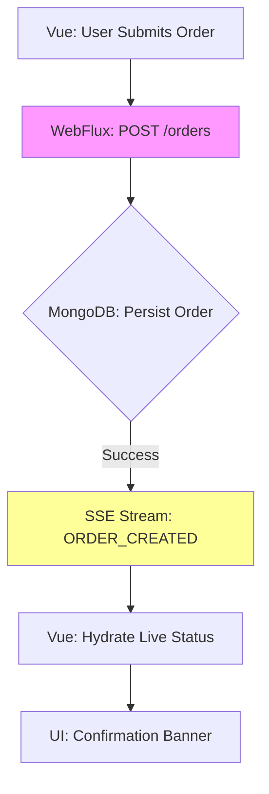

# 19 – End-to-End Testing – Flow Validation in Reactive Ecosystem

**File Path:** rules/05-test-strategy/19-e2e-testing.md  
**Domain:** TODO: <Business Context, e.g., "E-commerce payment processing with real-time updates">  
**Last Updated:** 2026-01-24
**Status:** Draft  

<!-- FILE_TITLE: End-to-End Testing Strategy for Reactive Flows -->
<!-- FILE_PATH: rules/05-test-strategy/19-e2e-testing.md -->

---

## 🎯 Purpose  
Validate end-to-end user journeys across the full reactive stack—Vue.js frontend, Spring WebFlux backend, and MongoDB—to ensure seamless data propagation, real-time stream consistency, and alignment with vibe coding principles (semantic annotations, intuitive naming, and non-blocking UX).  

This enforces reactive ecosystem integrity, focusing on complete flows rather than isolated components, while adhering to the test pyramid ratios from `17-test-pyramid.md`.

---

## 📌 Scope  
- **Applies to:** Business-critical user journeys involving UI interactions, reactive streams (e.g., SSE/WebSockets), and database persistence (e.g., payment submission to confirmation).  
- **Excludes:** Unit tests (`18-unit-testing.md`), pure integration tests, or non-reactive paths.  
- **Dependencies:**  
  - `17-test-pyramid.md` (Testing ratios and pyramid structure)  
  - `20-test-data-profiles.md` (Fixture and seeding management)  
  - `14-mermaid-diagrams.md` (Visual flow documentation)  

---

## 🧠 Semantic Anchors  

### 1. Naming DNA  
Adopt descriptive, flow-oriented naming to reflect end-to-end scope and vibe intent. Use patterns like `test<Domain><Action>Flow_E2E` for clarity and searchability.  

**Backend Example (Java/WebFlux):**  
```java  
@Test  
@Semantic("E2E_Payment_Flow")  
public void testPaymentProcessingFlow_E2E() {  
    // Simulate full journey: submission → stream → DB persistence  
}  
```  

**Frontend Example (TypeScript/Cypress):**  
```typescript  
describe('Order Management E2E', () => {  
  it('testUserCreatesAndCancelsOrderFlow_E2E', () => {  
    // Trigger UI action and assert reactive updates  
  });  
});  
```  

### 2. Annotation Taxonomy  
Leverage custom annotations to embed semantics for automated parsing (e.g., by LLMs or tools) and vibe alignment.  

- `@Semantic("E2E_<FlowType>")` – Tags the high-level journey (e.g., "E2E_Order_Stream_Validation").  
- `@Vibe("<UX_Intent>")` – Captures emotional/operational essence (e.g., "@Vibe("NonBlockingRealTimeUpdates")").  

**Example Usage:**  
```java  
@Vibe("Validates seamless UX during concurrent streams")  
public class PaymentE2ETests {  
    // ...  
}  
```  

### 3. Flow Visualization Mandate  
Every major E2E flow requires a Mermaid diagram for visual validation and documentation. Store in `features/<domain>/e2e-diagrams/`.  

**Example (Payment Flow):**  

*File Location:* `features/payment/e2e-diagrams/payment-flow.md`

---

## ⚙️ Enforcement Mechanics  
| Rule Type              | Tool/Mechanism                  | Failure Action                            |  
|------------------------|---------------------------------|-------------------------------------------|  
| Test Naming Compliance | Custom Gradle Plugin / ESLint   | Fail build / Block PR                     |  
| Diagram Presence       | Mermaid CLI in Git Pre-Commit   | Reject commit                             |  
| Data Seeding Integrity | YAML/JSON Schema Validation     | Disable test run / Report                 |  
| Reactive Coverage      | Jacoco + Istanbul (merged)      | Block merge on threshold                  |  
| Stream Timing          | Custom Cypress Commands (e.g., `cy.waitForStream()`) | Fail test on timeout |  

**CI/CD Integration Example (build.gradle.kts):**  
```kotlin  
tasks.register("validateE2E") {  
    dependsOn("backend:test", "frontend:test:e2e")  
    doLast {  
        // Run naming checks, diagram validation, and coverage merge  
    }  
}  
tasks.named("e2e").configure {  
    environment("TEST_ENV", "e2e")  
    systemProperty("spring.profiles.active", "e2e")  
}  
```

---

## 🔧 Technical Specifications  

### Backend Testing (Spring WebFlux)  
Use `WebTestClient` for non-blocking HTTP simulations, `Testcontainers` for MongoDB, and reactive assertions for streams. Activate E2E profiles for isolated environments.  

**Example:**  
```java  
@SpringBootTest(webEnvironment = SpringBootTest.WebEnvironment.RANDOM_PORT)  
@ActiveProfiles("e2e")  
@Testcontainers  
@Semantic("E2E_Order_Stream_Validation")  
@Vibe("Ensures real-time propagation without blocking")  
class OrderE2ETest {  
  
    @Container  
    static MongoDBContainer mongoDB = new MongoDBContainer("mongo:6");  
  
    @Autowired  
    private WebTestClient webTestClient;  
  
    @DynamicPropertySource  
    static void configureMongo(DynamicPropertyRegistry registry) {  
        registry.add("spring.data.mongodb.uri", mongoDB::getReplicaSetUrl);  
    }  
  
    @Test  
    void testOrderCreationToStreamEmission_E2E() {  
        // Seed initial data from fixture  
        seedData("order_base.yml");  
  
        // Trigger flow  
        webTestClient.post()  
            .uri("/api/orders")  
            .bodyValue(new OrderRequest("item-123", 1))  
            .exchange()  
            .expectStatus().isCreated()  
            .expectBody(OrderResponse.class)  
            .value(order -> assertThat(order.getStreamEndpoint()).isNotNull());  
  
        // Assert stream events and DB state  
        StepVerifier.create(orderService.getOrderStream("item-123"))  
            .expectNextMatches(event -> event.getStatus().equals("CREATED"))  
            .verifyComplete();  
  
        // Verify persistence  
        assertThat(mongoRepository.findById("order-123")).isPresent();  
    }  
}  
```  

### Frontend Testing (Vue.js / Cypress)  
Focus on UI reactivity to backend streams using intercepts for controlled mocking. Avoid fixed waits; use event-driven assertions.  

**Example:**  
```typescript  
// cypress/e2e/payment-flow.cy.ts  
describe('Payment E2E Flows', { testIsolation: false }, () => {  
  beforeEach(() => {  
    // Seed data via API or fixture  
    cy.task('seedDb', { profile: 'payment_edge_cases.yml' });  
    cy.visit('/checkout');  
  });  
  
  it('testPaymentSubmissionToConfirmation_E2E', () => {  
    // Intercept reactive stream  
    cy.intercept('GET', '/api/payments/stream*', { fixture: 'payment_events.json' }).as('paymentStream');  
  
    // Trigger user action  
    cy.get('[data-cy="submit-payment"]').click();  
  
    // Wait for and assert stream-driven UI update  
    cy.wait('@paymentStream', { timeout: 5000 });  
    cy.get('[data-cy="confirmation-banner"]').should('contain', 'Payment Successful');  
    cy.get('[data-cy="live-status"]').should('have.text', 'Processed');  
  });  
});  
```  

### Test Data Profiles  
Use versioned YAML/JSON fixtures from `20-test-data-profiles.md` for reproducibility. No inline data in tests.  

**Example Fixture (features/payment/fixtures/payment_edge_cases.yml):**  
```yaml  
version: 1.0  
scenarios:  
  - name: "Successful Payment"  
    events:  
      - type: PAYMENT_INITIATED  
        payload:  
          id: "pay-123"  
          amount: 99.99  
          status: "PENDING"  
      - type: PAYMENT_CONFIRMED  
        payload:  
          id: "pay-123"  
          status: "COMPLETE"  
  - name: "Failed Payment Edge Case"  
    events:  
      - type: PAYMENT_DECLINED  
        payload:  
          id: "pay-456"  
          reason: "Insufficient Funds"  
```  
Integrate via custom Cypress tasks or Spring's `@Sql` for seeding.

---

## 📋 Compliance Checklist  
- [ ] All E2E tests use `@Semantic("E2E_<Flow>")` and follow naming pattern `test<Domain><Action>Flow_E2E`.  
- [ ] Mermaid diagrams are present for each flow in `features/<domain>/e2e-diagrams/`.  
- [ ] Tests validate full stack: UI action → stream → DB persistence → UI reaction.  
- [ ] Data seeded from versioned profiles (no inline mocks).  
- [ ] Reactive assertions cover stream emissions (e.g., `StepVerifier` backend, `cy.wait('@alias')` frontend).  
- [ ] Enforcement tools integrated (Gradle tasks, Git hooks).  
- [ ] Local run: `./gradlew e2eTest` and `npm run cypress:run` pass without issues.  

---

## 🔗 Interlocks  
- **Test Pyramid:** `17-test-pyramid.md` (E2E as 10-20% of suite).  
- **Data Management:** `20-test-data-profiles.md` (fixtures and seeding).  
- **Diagrams:** `14-mermaid-diagrams.md` (standardization).  
- **Review Process:** `16-review-checklist.md` (E2E coverage in PRs).  
- **Build Setup:** `22-gradle-multimodule.md` (multi-module E2E tasks).  
- **Static Resources:** `23-static-resources.md` (if UI involves assets).  

---

## 📜 Revision History  
| Version | Date       | Author          | Changes Summary                                                  |  
|---------|------------|-----------------|------------------------------------------------------------------|  
| 1.0     | 2026-01-24 | LLM-Generated   | Initial draft aligned to reactive ecosystem and vibe principles. |  

---

## Key Implementation Steps  
1. **Clone and Customize:** Copy this to `rules/05-test-strategy/19-e2e-testing.md`; replace TODOs with project details (e.g., domain, date, owner).  
2. **Add Diagrams:** Create Mermaid files for core flows in `features/<domain>/e2e-diagrams/`.  
3. **Tool Setup:** Implement Gradle tasks for naming/diagram checks; add Cypress commands for stream waits.  
4. **Integrate CI:** Hook into existing pipeline (e.g., GitHub Actions) for automated E2E runs.  
5. **Vibe Alignment:** Ensure annotations reflect business intent; review for non-blocking, intuitive flows.  

This strategy promotes robust, reactive validation while minimizing flakiness through fixtures and event-driven tests.
