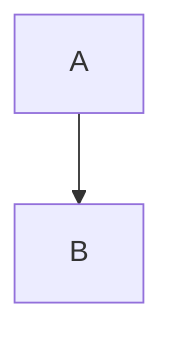

# Kilo Code Project Rules Directory

**File Path:** `/rules/README.md`  
**Domain:** Reactive Full-Stack Applications (Java/Spring Boot/WebFlux + Vue/TypeScript) 
**Last Updated:** 2026-01-22
**Status:** Active

---

## 📖 Introduction  
The `rules/` directory establishes standardized, machine-parsable guidelines for Kilo Code projects, emphasizing "vibe coding" through semantic naming, AI-optimized annotations, and strict reactive patterns. This ensures intent-driven development across backend (Spring WebFlux) and frontend (Vue 3 with TypeScript), while enforcing modular boundaries, automated validation, and LLM-assisted maintainability. Rules are designed for seamless integration with tools like Gradle, ESLint, and Mermaid CLI, promoting consistency in monorepo setups with MongoDB persistence.

---

## 🗂️ Directory Structure & File Descriptions  
The directory is organized into categories for foundational setup, semantics, coding standards, workflows, testing, builds, modularity, and changelogs. Each subcategory contains Markdown files with machine-parsable formats, including semantic anchors, enforcement details, and compliance checklists.

```
rules/
├── 01-project/                        # Foundational setup and constraints
│   ├── 01-project-overview.md         # Goals, scope, domain context (e.g., "Secure user payments via Stripe")
│   ├── 02-technology-stack.md         # Versions: Java 17+, Spring Boot 3.2, Vue 3.4, MongoDB 7, Gradle 8+
│   ├── 03-folder-structure.md         # Monorepo layout rules (e.g., backend/frontend split, static resources in /src/main/resources/static)
│   └── 04-modular-architecture.md     # Boundaries: <domain>-module (e.g., user-module); no circular deps; DTO-only inter-module comms
│
├── 02-semantics/                      # Vibe coding core: Naming and markup
│   ├── 05-vibe-coding.md              # Principles: Semantic intent in names (e.g., fetchActiveUserStream for Flux<User>)
│   ├── 06-naming-conventions.md       # Suffixes: DTO/Entity; async markers (e.g., *Async); Vue props (typed with guards)
│   ├── 07-semantic-comments.md        # JSDoc/Javadoc templates: Focus on "why" (e.g., "// Why: Prevents race conditions in concurrent updates")
│   └── 08-code-section-ordering.md    # Mandatory structure: Imports → Constants → Domain → Logic → Exports
│
├── 03-coding-standards/               # Language-specific rules
│   ├── 09-java-style.md               # WebFlux: Reactive patterns (e.g., Mono/Flux naming); Lombok for boilerplate; 4-space indent
│   ├── 10-typescript-style.md         # Vue SFC: <script setup lang="ts"> with typed props/emits; <style scoped>; strict typing
│   ├── 11-html-css-rules.md           # Static assets: <script src="/static/v1/app.js" defer>; no inline JS; scoped CSS only
│   └── 12-annotations.md              # Custom tags: @dataflow for streams, @Semantic("AggregateRoot") for entities; @Vibe for logging
│
├── 04-workflow/                       # Mini-sprint feature lifecycle
│   ├── 13-feature-lifecycle.md        # 7-step flow: 1. Branch (feat/user-authn) → 2. Mermaid spec → 3. Models/DTOs → 4. Test Data Profiles → 5. Tests → 6. Logic → 7. Review
│   ├── 14-mermaid-diagrams.md         # Syntax: Flow/sequence standards (e.g., graph TD; A-->B; style A fill:#f9f)
│   ├── 15-feature-repo-index.md       # Nested folders in /features/ (e.g., features/search/models/); one feature per sprint
│   └── 16-review-checklist.md         # Pre-merge: Naming validation, diagram presence, test coverage (e.g., 80% min)
│
├── 05-test-strategy/                  # Testing mandates and pyramid enforcement
│   ├── 17-test-pyramid.md             # Ratios: 70% unit (JUnit/Mockito), 20% integration (Testcontainers for Mongo), 10% e2e (Cypress/Vue Testing Lib)
│   ├── 18-unit-testing.md             # Parameterized tests; @MockBean for services; no in-test data gen (use profiles)
│   ├── 19-e2e-testing.md              # Full flows with data seeding; WebFlux handler mocks via JSON fixtures
│   ├── 20-test-data-profiles.md       # Naming: <feature>_<context>.yml (e.g., auth_edge_cases.yml); activate via @ActiveProfiles
│   └── 21-boundary-scenarios.md       # Tables for negatives (e.g., | Input | Expected | Why Fail |)
│
├── 06-build/                          # CI/CD and integration
│   ├── 22-gradle-multimodule.md       # Task sequencing: compileJava → compileTypeScript → test → assemble; frontend hooks (e.g., vite build)
│   ├── 23-static-resources.md         # Vue assets to /src/main/resources/static; cache busting via version tokens (e.g., /static/v2/)
│   ├── 24-artifact-naming.md          # JARs: <project-name>-<module>-<version>.jar; test flags (-PtestProfile=user-authn)
│   ├── 25-data-migration.md           # Versioned fixtures for DB seeding (e.g., mongo-init/v1/users.yml)
│   └── 26-docker.md                   # Packaging application to docker containers and installation to server
│
├── 07-modularity/                     # Advanced architecture
│   ├── 27-dependency-rules.md         # Allowed: domain → svc; Forbidden: ctrl → repo; enforce via Gradle deps
│   ├── 28-refactoring-guidelines.md   # Split/merge rules without breaking semantics (e.g., extract Flux pipelines)
│   └── 29-semantic-discoverability.md # Infer behavior from names alone (e.g., stream* for events, validate* for checks)
│
└── 08-changelog/                      # Release practices
    └── 30-semantic-versioning.md      # Bump criteria: major (breaking), minor (feat), patch (fix); link to features/
```

---

## 🎯 Core Philosophy  
1. **Vibe Coding**: Treat code as self-documenting via semantic naming (e.g., `streamFailedPaymentsAsync()` for `Flux<Payment>`), LLM-parsable annotations (`@Semantic("EventStream")`, `@Vibe("Prevents race conditions")`), and strict file ordering. Intent must be graspable in <3 seconds.  
2. **Reactive Integrity**: Unified patterns—backend `Mono`/`Flux` with async suffixes; frontend Vue props mirroring DTOs (e.g., `PaymentStreamDto` → `paymentStream: PaymentStream`). Track dataflow with `@dataflow(backend-to-frontend)`.  
3. **Modular Monolith**: Enforce domain isolation via Gradle modules; communication via DTOs only, with no circular deps.  
4. **AI-First Design**: Annotations enable LLM refactoring/audits (e.g., "Query all `@dataflow` tags"); structural consistency for automated tools.

---

## 🧠 Semantic Anchors & Patterns  
### Naming DNA  
- **Pattern**: Verb-Domain-Context-ExecutionModel (e.g., `transformOrderToShipmentEventAsync()`).  
- **Java Example**:  
  ```java  
  @Semantic("EventStream")  
  @Vibe("Real-time failure notifications")  
  public Flux<Payment> streamFailedPaymentsAsync(String userId) {  
      return paymentRepository.findFailedByUser(userId).delayElements(Duration.ofSeconds(1));  
  }  
  ```  
- **TypeScript/Vue Example**:  
  ```vue  
  <script setup lang="ts">  
  /**  
   * @Vibe "Visualizes payment stream without UI blocking"  
   * @Semantic("DataVisualizer")  
   * @dataflow(backend-to-frontend)  
   */  
  interface Props {  
      paymentStream: Payment[];  // Mirrors Flux<Payment> emissions  
  }  
  const props = defineProps<Props>();  
  </script>  
  ```  

### Annotation Taxonomy  
- `@Semantic`: Defines role (e.g., "AggregateRoot", "EventStream").  
- `@Vibe`: Explains emotional/contextual intent (e.g., "Atomic processing with rollback").  
- `@dataflow`: Tracks cross-stack handoffs.  

### Code Section Ordering  
Mandatory in all files:  
1. Imports/Requires  
2. Constants/Interfaces  
3. Domain Logic (pure functions)  
4. Reactive Plumbing (Flux/Mono)  
5. Exports/Handlers  

---

## ⚙️ Enforcement & Automation  
### Enforcement Matrix  
| Rule Type       | Tools/Mechanisms                  | CI Action          | Auto-Fix? |
|-----------------|-----------------------------------|--------------------|-----------|
| Naming          | ESLint (TS), Checkstyle (Java)    | Block PR          | ✅ (some)  |
| Annotations     | Custom Gradle `verifyVibe` task   | Fail build        | ❌         |
| Reactivity      | SonarQube (blocking detection)    | Warn + auto-ticket| ❌         |
| Diagrams        | Mermaid CLI in pre-commit hooks   | Reject invalid    | ❌         |
| Coverage        | JaCoCo + Vitest                   | Block if <80%     | ❌         |

### Gradle Integration Example  
```kotlin  
// build.gradle.kts (root)  
tasks.register("verifyVibe") {  
    dependsOn(":backend:checkstyleMain", ":frontend:eslint")  
    doLast {  
        exec { commandLine("node", "scripts/vibe-scanner.js", "--threshold=90") }  // Scans @Vibe/@Semantic coverage  
        exec { commandLine("mmdc", "-i", "diagrams/flow.mmd", "-o", "output.png") }  // Validates Mermaid  
    }  
}  
// Run: ./gradlew verifyVibe  
```  

**PR Workflow**: Blocked if vibe-score <90, missing annotations, or untyped props. IDE extensions (IntelliJ/VS Code) highlight issues.

---

## 🔧 Implementation Workflow  
1. **Branching**: `feat/[semantic-verb]-[domain]` (e.g., `feat/validate-inventory-payment`).  
2. **Specification**: Create Mermaid diagram in `/features/[domain]/semantic-diagram.md`. Example:  
   ```mermaid  
   graph TD  
       A[Order Created] --> B[validatePaymentIntentAsync]  
       B --> C{Valid?}  
       C -->|Yes| D[streamOrderEventsFlux]  
       C -->|No| E[publishFailureEvent]  
       %% Why: Ensures atomic validation before streaming  
   ```  
3. **Coding**: Follow section ordering; add annotations. Mirror backend DTOs in Vue (auto-validated via shared types).  
4. **Validation**: `./gradlew verifyVibe` (local) + full CI on PR.  
5. **Static Assets**: Place Vue builds in `/static/v1.3/` for versioning/cache-busting (e.g., `<script src="/static/v1.3/app.js" defer></script>`).  
6. **Testing**: Unit first (70%), then integration/e2e; include boundary tables.  
7. **Merge**: Review checklist passed; update changelog.

---

## 📋 Rule Template  
All rule files MUST use this format for parsability:  

```markdown  
# [ID] – [Title]  
<!-- FILE_TITLE: Internal reference -->  
<!-- FILE_PATH: rules/02-semantics/05-vibe-coding.md -->  

**Domain:** [e.g., Payment Processing]  
**Status:** Active | Draft | Deprecated  
**Last Updated:** YYYY-MM-DD  

## 🎯 Purpose  
Single-sentence objective (e.g., "Enforces reactive naming for WebFlux streams to convey intent instantly").  

## 📌 Scope  
- **Applies to:** [e.g., All async Java methods and Vue props]  
- **Excludes:** [e.g., Legacy synchronous code]  
- **Linked Rules:** [e.g., 06-naming-conventions.md]  

## 🧠 Semantic Anchors  
### Naming DNA  
```java  
// Verb-Domain-Context-ExecutionModel  
@Semantic("EventStream")  
public Flux<Order> streamOrdersAsync() { ... }  
```  

### Annotation Taxonomy  
```typescript  
/** @Vibe "UI-safe data binding" */  
const props = defineProps<OrderStream>();  
```  

## ⚙️ Enforcement  
| Tool/Mechanism     | Target                  | Auto-Fix? | Failure Action |  
|--------------------|-------------------------|-----------|----------------|  
| Gradle verifyVibe  | Missing @Semantic      | ❌        | Fail build      |  
| ESLint react-naming| No *Flux suffix        | ✅        | Block PR        |  

## 🔧 Examples  
**Current (v1.3+):** Mandatory `@dataflow` for streams.  
- Anti-pattern: `getUsers()` → Correct: `streamActiveUsersFlux()`.  
**Mermaid Integration:**  


## 📋 Compliance Checklist  
- [ ] Async methods suffixed `Async`/`Flux`  
- [ ] Annotations on >90% public APIs  
- [ ] 3-second intent test passed  
- [ ] `./gradlew verifyVibe` succeeds  

## 🔗 Interlocks  
- Aligns with: 09-java-style.md  
- Depends on: 22-gradle-multimodule.md  

## 📜 Revision History  
| Version | Date       | Author      | Changes                  | Impact    |  
|---------|------------|-------------|--------------------------|-----------|  
| 1.3     | 2024-10-01 | @arch-team | Added @dataflow tags    | All rules   |  
| 1.2     | 2024-08-15 | @dev-lead  | Vibe-score threshold    | Workflows   |  
```

---

## 📈 Key Differentiators  
- **AI-Optimized**: `@Semantic`/`@Vibe` tags allow LLM queries (e.g., "Refactor all EventStream methods") and automated audits.  
- **Cross-Stack Sync**: Backend DTOs auto-map to Vue interfaces; `@dataflow` ensures traceability.  
- **Emotional Integrity**: Names evoke intent (e.g., `publishInventoryAlertEvent()` over `sendNotification()`).  
- **Rigor Without Rigidity**: Automation handles 80% enforcement; human review for edge cases.  

## 🚀 Quick Start  
1. Copy template: `cp TEMPLATE.md rules/03-coding-standards/30-new-rule.md`.  
2. Customize with domain (e.g., "real-time order processing").  
3. Add examples/anchors.  
4. Validate: `./gradlew verifyVibe`.  
5. PR with `@Vibe`-annotated changes.  

## 📜 Revision History  
| Version | Date       | Author          | Changes Summary                                          |  
|---------|------------|-----------------|----------------------------------------------------------|  
| 1.0     | 2026-01-22 | LLM-Generated   | Initial structure with semantic anchors and enforcement. |  

---

**Conclusion**: This ruleset fosters scalable, reactive systems by blending semantics, automation, and modularity—reducing debt and accelerating AI-assisted evolution. For audits, query: "Summarize all @Vibe tags in payment domain."